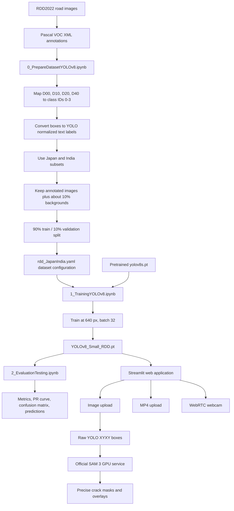
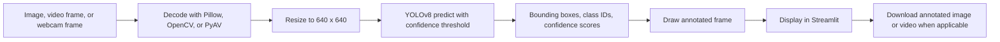
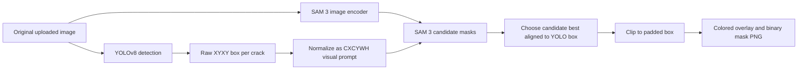

# RoadDamageDetection Repository Guide

## What the project does

This project detects four road-damage classes with a custom YOLOv8-small object-detection model:

| Model ID | Class |
| --- | --- |
| `D00` / `0` | Longitudinal Crack |
| `D10` / `1` | Transverse Crack |
| `D20` / `2` | Alligator Crack |
| `D40` / `3` | Potholes |

The trained checkpoint is `models/YOLOv8_Small_RDD.pt`. A Streamlit multipage app accepts an image, an MP4 video, or a live WebRTC webcam stream.

## End-to-end flowchart



## Runtime inference flow



## Technology stack

| Layer | Technology | Role |
| --- | --- | --- |
| Language | Python | Application, training, and inference code |
| UI/server | Streamlit | Multipage local web application |
| Detection | Ultralytics YOLOv8-small | Object detection and annotation |
| Deep learning | PyTorch / Torchvision | Model execution and tensor operations |
| Images/video | OpenCV, NumPy, Pillow | Decoding, resizing, color conversion, and file output |
| Realtime video | streamlit-webrtc, aiortc, PyAV | Browser webcam streaming and frame callbacks |
| Mask refinement | Meta SAM 3.1 | Converts YOLO box prompts into pixel-accurate masks |
| SAM integration | FastAPI HTTP service | Isolates SAM 3's newer Python/PyTorch/CUDA stack |
| Connectivity | STUN server selected with Requests | Establishes WebRTC peer connectivity |
| Dataset | CRDDC2022 / RDD2022 | Labeled road-damage images |
| Annotation formats | Pascal VOC XML and YOLO text labels | Source and training label formats |
| Training workflow | Jupyter notebooks | Dataset conversion, training, validation, and testing |
| Optional acceleration | NVIDIA CUDA | GPU training/inference on supported Linux/Windows systems |

## Important files

| File | Purpose |
| --- | --- |
| `Home.py` | Streamlit landing page and app entry point |
| `pages/1_Realtime Detection.py` | Webcam inference using WebRTC |
| `pages/2_Image Detection.py` | Uploaded image inference and result download |
| `pages/3_Video Detection.py` | Frame-by-frame MP4 inference and result download |
| `models/YOLOv8_Small_RDD.pt` | Trained YOLOv8-small checkpoint |
| `sample_utils/download.py` | Downloads the checkpoint if it is missing |
| `sample_utils/get_STUNServer.py` | Selects a nearby public STUN server |
| `segmentation/` | SAM 3 client plus mask overlay/download utilities |
| `sam3_service/` | Isolated official SAM 3 CUDA inference service |
| `training/0_PrepareDatasetYOLOv8.ipynb` | Converts and filters the dataset |
| `training/1_TrainingYOLOv8.ipynb` | Fine-tunes YOLOv8-small |
| `training/2_EvaluationTesting.ipynb` | Runs validation and produces evaluation artifacts |

## Running this clone on Apple silicon

The repository's original `av==10.0.0` pin does not provide a compatible wheel for current Apple-silicon environments. This clone was run successfully with Python 3.10, the original core versions, and a current WebRTC/PyAV pair.

```bash
cd RoadDamageDetection
uv venv --python /opt/homebrew/bin/python3.10 .venv
UV_CACHE_DIR=.uv-cache uv pip install --python .venv/bin/python \
  numpy==1.24.3 Pillow==9.5.0 torch==2.0.0 \
  ultralytics==8.0.201 opencv-python-headless==4.8.0.74 \
  requests==2.28.2 streamlit-webrtc
.venv/bin/streamlit run Home.py
```

Open <http://127.0.0.1:8501>. On other platforms, first try the original instructions in `README.md` and `requirements.txt`.

## YOLO to SAM 3 mask refinement

Do not send the already-annotated YOLO image to SAM 3. The drawn rectangle and label become image pixels and can contaminate segmentation. The implemented path keeps the source image unchanged and passes YOLO's raw coordinates separately:



The Streamlit app and SAM 3 intentionally run in separate environments. Meta's official SAM 3.1 implementation requires Python 3.12+, PyTorch 2.7+, CUDA 12.6+, a CUDA GPU, and approved access to its gated Hugging Face checkpoint. Follow `sam3_service/README.md` on a compatible local or remote GPU machine, set `SAM3_SERVICE_URL`, and enable the SAM 3 checkbox on the Image Detection page.

## How to read the repository

1. Start with `Home.py` and the three files in `pages/` to understand the user-facing inference paths.
2. Read `training/0_PrepareDatasetYOLOv8.ipynb` to see class mapping, box conversion, filtering, and splitting.
3. Read `training/1_TrainingYOLOv8.ipynb` for the model and hyperparameters.
4. Read `training/2_EvaluationTesting.ipynb` and inspect `resource/PR_curve.png` and `resource/confusion_matrix.png` for evaluation.
5. Inspect the shared checkpoint in `models/` to connect training output to every deployed inference page.
